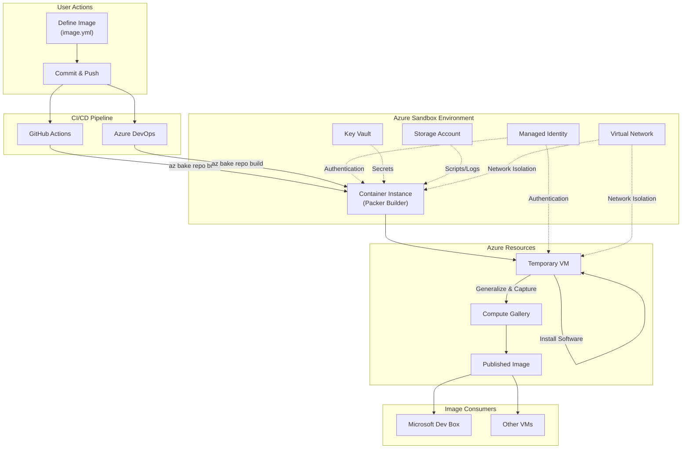
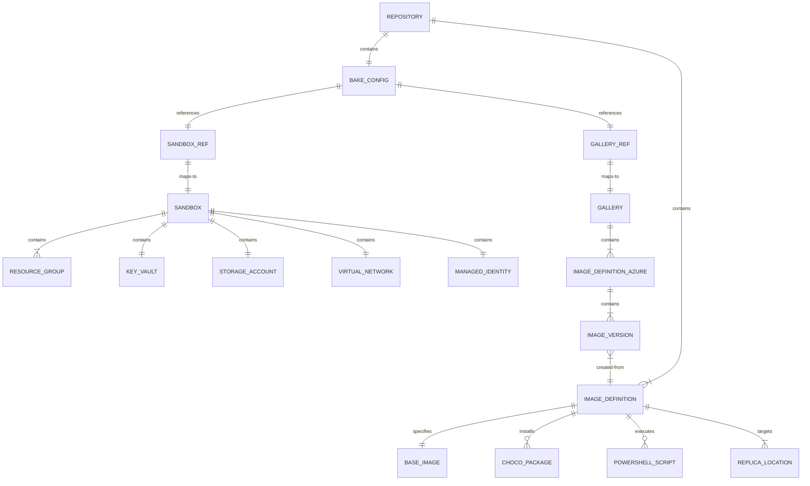

# Business Logic Summary: az bake

## Executive Summary

**az bake** is an Azure CLI extension designed to simplify and automate the creation of custom virtual machine (VM) images for enterprise use, particularly for developer workstations and DevBox environments. The tool addresses the challenge organizations face when they need standardized, pre-configured VM images with specific software, tools, and configurations installed.

**Target Users**: DevOps engineers, platform teams, and IT administrators who manage developer environments across organizations.

**Key Problems Solved**:
- Eliminates manual, error-prone custom image creation processes
- Provides secure, isolated image building within Azure infrastructure
- Enables version-controlled, repeatable image definitions
- Integrates with CI/CD pipelines (GitHub Actions, Azure DevOps) for automated image updates
- Centralizes image publishing to Azure Compute Galleries for distribution

## High-Level Business Diagram



## Core Business Entities

### 1. Sandbox
A **Sandbox** is a secure, isolated Azure environment where custom images are built. It contains all the infrastructure needed to execute Packer builds safely within a private network.

**Business Purpose**: Provides a controlled, repeatable environment for image creation that enforces security boundaries and enables credential management.

**Key Attributes**:
- Resource Group (contains all sandbox resources)
- Key Vault (secrets and credentials)
- Storage Account (scripts, logs, artifacts)
- Virtual Network with two subnets:
  - Default subnet (for temporary VMs and private endpoints)
  - Builders subnet (for container instances running Packer)
- Managed Identity (for secure Azure resource access)

### 2. Gallery
An **Azure Compute Gallery** where published custom images are stored and distributed.

**Business Purpose**: Centralized repository for versioned images that can be shared across teams, regions, and subscriptions.

**Key Attributes**:
- Gallery name and location
- Resource group
- Contains multiple image definitions and versions

### 3. Image
An **Image** represents a custom VM image definition that specifies what software and configuration should be installed.

**Business Purpose**: Declarative specification of a standardized developer workstation or VM configuration.

**Key Attributes**:
- Identity (name, publisher, offer, SKU, version)
- Base image (marketplace image to start from)
- Operating system (Windows/Linux)
- Replica locations (regions where image is available for optimized deployment latency)
- Installation specifications:
  - Chocolatey packages (machine-level and user-level)
  - PowerShell scripts (with optional restart triggers)
  - Winget packages (preview/partial support)
- Optional settings (Windows Update, hibernate support)
- Marketplace plan information (for images requiring license agreement)

### 4. Repository
A **Repository** is a Git-based project containing image definitions and configuration.

**Business Purpose**: Version-controlled source of truth for image definitions, enabling GitOps workflows for image management.

**Key Attributes**:
- bake.yml configuration file (sandbox and gallery references)
- images/ directory with individual image.yml definitions
- CI/CD workflow files (auto-generated)
- Support for GitHub and Azure DevOps

**Configuration Hierarchy**:
- **bake.yml**: Repository-level configuration linking to sandbox infrastructure and target gallery
- **image.yml**: Individual image definitions specifying base image, software, and deployment settings

## Business Processes

### Process 1: Sandbox Creation

**Purpose**: Establish the secure Azure infrastructure needed to build custom images.

**Trigger**: Administrator runs `az bake sandbox create` command.

**Steps**:
1. Validate the provided parameters (name prefix, gallery, location)
2. Create or verify resource group exists
3. Generate unique names for resources (Key Vault, Storage, VNet, Identity)
4. Deploy ARM template to provision:
   - Key Vault for secrets management
   - Storage Account for artifacts and logs
   - Virtual Network with subnets
   - Managed Identity for secure access
5. Configure permissions between resources
6. Tag resources for identification and tracking

**Outcome**: A fully configured sandbox environment ready for image building.

### Process 2: Repository Setup

**Purpose**: Configure a Git repository for image building workflows.

**Trigger**: User runs `az bake repo setup` command.

**Steps**:
1. Validate sandbox and gallery exist
2. Generate bake.yml configuration file
3. Detect repository provider (GitHub or Azure DevOps)
4. Create appropriate CI/CD workflow file:
   - GitHub: .github/workflows/bake_images.yml
   - Azure DevOps: azure-pipelines.yml

**Outcome**: Repository is ready to define and build images with automated pipelines.

### Process 3: Image Definition Creation

**Purpose**: Create a new custom image definition in the repository.

**Trigger**: User runs `az bake image create --name MyImage`.

**Steps**:
1. Create images/{ImageName}/ directory
2. Generate image.yml with default values:
   - Windows 11 Enterprise base image
   - Sample Chocolatey packages
   - Version 0.0.1
3. User customizes the generated file

**Outcome**: New image definition ready for customization and building.

### Process 4: Image Building (CI/CD)

**Purpose**: Build and publish custom images to Azure Compute Gallery.

**Trigger**: 
- Push to main branch with changes to bake.yml or images/
- Manual workflow dispatch

**Steps**:
1. CI pipeline authenticates to Azure (service principal)
2. Install az bake extension
3. Run `az bake repo build`
4. For each image definition:
   - Deploy Azure Container Instance with Packer
   - Clone repository to container
   - Execute Packer build:
     - Create temporary VM from base image
     - Apply Windows Updates (if enabled)
     - Run PowerShell installation scripts
     - Install Chocolatey packages (machine-level)
     - Install user-level packages via Active Setup
     - Generalize VM (sysprep)
     - Capture image to Gallery
   - Replicate image to specified regions
5. Clean up temporary resources

**Outcome**: New image version published to Azure Compute Gallery.

### Process 5: Version Management

**Purpose**: Manage semantic versions of image definitions.

**Trigger**: User runs `az bake image bump`.

**Steps**:
1. Locate image.yml files in repository
2. Parse current version (major.minor.patch)
3. Calculate new version based on flags:
   - --major: Increment major, reset minor and patch
   - --minor: Increment minor, reset patch
   - (default): Increment patch
4. Update version in image.yml files

**Outcome**: Image versions are incremented following semantic versioning.

### Process 6: Build Monitoring

**Purpose**: Monitor and troubleshoot image builds.

**Trigger**: User runs `az bake image logs`.

**Steps**:
1. Locate container group for the image build
2. Retrieve container logs from Azure Container Instance
3. Display Packer build output

**Outcome**: User can view build progress and diagnose failures.

## Business Rules and Validations

### Image Definition Rules
| Rule | Description |
|------|-------------|
| Required Properties | publisher, offer, sku, version, os, replicaLocations must be specified |
| Version Format | Must follow semantic versioning (major.minor.patch) |
| OS Support | Windows or Linux supported; DevBox requires Windows |
| Base Image | Windows images default to Win11 Enterprise; Linux images must specify base explicitly |
| Unique Versions | Cannot publish an image version that already exists |
| Security | All images created with Trusted Launch security enabled (Gen 2 VMs) |
| Marketplace Plans | Images from marketplace offerings requiring license agreement must include plan information |

### Sandbox Rules
| Rule | Description |
|------|-------------|
| Resource Naming | Names auto-generated from prefix following Azure naming constraints |
| Subnet Delegation | Builders subnet must be delegated to Azure Container Instance |
| Identity Permissions | Managed Identity requires Contributor role on Gallery |
| Network Isolation | All builds occur within private virtual network |
| Network Customization | VNet/subnet CIDR ranges can be customized to avoid conflicts with existing networks |

### Repository Rules
| Rule | Description |
|------|-------------|
| Git Required | Repository must have .git directory |
| Provider Detection | Automatically detects GitHub vs Azure DevOps from git config |
| bake.yml Required | Configuration file must exist at repository root |
| image.yml Required | Each image directory must contain image.yml |

### CI/CD Rules
| Rule | Description |
|------|-------------|
| Authentication | Service principal credentials required in CI environment |
| Token for Private Repos | GITHUB_TOKEN or SYSTEM_ACCESSTOKEN required for private repositories |
| Manual Override Prohibited | --repo-url, --repo-token flags cannot be used in CI |

## User Configuration and Defaults

Users can configure default values to simplify repeated commands:

| Setting | Purpose | Command |
|---------|---------|--------|
| bake-sandbox | Default sandbox resource group | `az configure --defaults bake-sandbox=<name>` |
| bake-gallery | Default Azure Compute Gallery | `az configure --defaults bake-gallery=<id>` |

Once configured, these defaults eliminate the need to specify `--sandbox` and `--gallery` on every command.

## User Roles and Capabilities

### Platform Administrator
**Responsibilities**:
- Create and manage sandbox environments
- Configure Azure Compute Galleries
- Set up service principals and permissions
- Initial repository setup

**Capabilities**:
- `az bake sandbox create` - Provision sandbox infrastructure
- `az bake sandbox validate` - Verify sandbox configuration
- `az bake repo setup` - Initialize repository for baking

### DevOps Engineer / Image Author
**Responsibilities**:
- Define and maintain custom image definitions
- Configure software installations
- Manage image versions
- Troubleshoot build failures

**Capabilities**:
- `az bake image create` - Create new image definitions
- `az bake image bump` - Increment image versions
- `az bake image logs` - View build logs
- `az bake image rebuild` - Retry failed builds
- `az bake repo validate` - Validate repository configuration

### CI/CD Pipeline (Automated)
**Responsibilities**:
- Execute automated image builds
- Authentication and authorization

**Capabilities**:
- `az bake repo build` - Build all images in repository

## Decision Logic

### Software Installation Method Selection
```
IF image.update = true THEN
    Run Windows Update first (ensures latest security patches)
    
IF image.install.scripts.powershell exists THEN
    Execute PowerShell scripts in sequential order
    IF script.restart = true THEN
        Restart VM (required for features like Hyper-V)
        Continue with remaining scripts after restart
    
IF image.install.choco.packages exists THEN
    Install Chocolatey package manager
    
    FOR EACH package in choco.packages:
        IF package.user = false THEN
            Install as machine-level package (available to all users)
        ELSE
            Register with Windows Active Setup
            Package installs automatically on first user logon
            (Enables per-user app customization)
```

**Script Restart Business Value**: Some Windows features (e.g., Hyper-V, certain drivers) require a restart before subsequent software can be installed. The restart capability enables complex multi-phase installations within a single image definition.

### Repository Provider Detection
```
IF git remote URL contains "github.com" THEN
    provider = GitHub
    Generate GitHub Actions workflow
ELSE IF git remote URL contains "dev.azure.com" OR "visualstudio.com" THEN
    provider = AzureDevOps
    Generate Azure DevOps pipeline
ELSE
    Require user to specify --provider
```

### Version Upgrade Detection
```
IF current_version < latest_release THEN
    Notify user of available upgrade
    
IF --pre flag specified THEN
    Use latest prerelease version
ELSE IF --version specified THEN
    Use specific version
ELSE
    Use latest stable version
```

## External Business Integrations

### Azure Compute Gallery
**Purpose**: Image storage and distribution
**Integration Type**: Azure Resource Manager API
**Business Value**: Enables controlled sharing of images across teams and regions

### Azure Container Instance
**Purpose**: Packer build execution
**Integration Type**: Azure Resource Manager API
**Business Value**: Provides isolated, ephemeral compute for image building without managing VMs

### HashiCorp Packer
**Purpose**: Image building automation
**Integration Type**: CLI execution within container
**Business Value**: Industry-standard tool for creating machine images

### Chocolatey Package Manager
**Purpose**: Windows software installation
**Integration Type**: PowerShell commands
**Business Value**: Enables declarative software installation from public or private feeds

**Package Installation Options**:
- Custom package sources (private feeds)
- Specific version pinning
- Installation arguments passthrough
- Machine-level vs user-level installation
- Restart triggers after installation

### GitHub / Azure DevOps
**Purpose**: CI/CD pipeline execution
**Integration Type**: Workflow/pipeline files and environment variables
**Business Value**: Automated image building on code changes

### Azure Marketplace
**Purpose**: Base image source
**Integration Type**: Packer Azure ARM builder
**Business Value**: Access to official Microsoft images as starting points

## Data Relationships



## Key Business Workflows

### Multi-Region Image Distribution
When images specify multiple `replicaLocations`, the Azure Compute Gallery automatically replicates the image to each region. This provides:
- **Reduced latency**: VMs deploy faster from local image copies
- **Compliance**: Images stored in required geographic regions
- **Disaster recovery**: Images available even if one region is unavailable
- **Cost optimization**: Avoids cross-region data transfer during VM deployment

### Workflow 1: Initial Setup (One-time)
1. Create Azure Compute Gallery for organization
2. Create service principal for CI/CD authentication
3. Run `az bake sandbox create` with gallery and principal
4. Add service principal credentials to CI/CD secrets
5. Run `az bake repo setup` in repository

### Workflow 2: Add New Developer Image
1. Run `az bake image create --name DevImage`
2. Edit images/DevImage/image.yml:
   - Set appropriate base image
   - Add required Chocolatey packages
   - Add custom PowerShell scripts
3. Commit and push changes
4. CI/CD pipeline builds and publishes image
5. Image available in Gallery for VM/DevBox creation

### Workflow 3: Update Existing Image
1. Modify image.yml with new packages or scripts
2. Run `az bake image bump` to increment version
3. Commit and push changes
4. CI/CD pipeline builds new version
5. Previous versions remain available in Gallery

### Workflow 4: Troubleshoot Failed Build
1. Check CI/CD pipeline logs for initial errors
2. Run `az bake image logs --name ImageName` for Packer output
3. Identify failure point (package installation, script error, etc.)
4. Fix image.yml or scripts
5. Run `az bake image rebuild` or push new commit

## User Interaction Flows

### CLI Command Flow
```
User → az bake <command> → Input Validation → Azure Authentication → 
Business Logic → Azure API Calls → Output/Feedback → User
```

### Image Build Flow (Automated)
```
Git Push → CI Pipeline Trigger → Azure Login → az bake Install →
az bake repo build → ARM Template Deploy → Container Start →
Packer Init → Packer Build → Image Capture → Pipeline Complete
```

## Error Handling and User Feedback

### Validation Errors
| Scenario | User Feedback |
|----------|---------------|
| Missing required image property | "image.yml is missing required property: {property}" |
| Invalid sandbox configuration | "No identity found in sandbox resource group" |
| Repository not initialized | "Could not find .git directory" |
| Invalid version format | "Version must be in format major.minor.patch" |

### Build Errors
| Scenario | User Feedback |
|----------|---------------|
| Image version exists | "Image version already exists" |
| Gallery not found | "Could not find gallery {name} in resource group {rg}" |
| Packer build failure | "Packer build failed" with logs available via `az bake image logs` |

### Recovery Options
| Error Type | Recovery Action |
|------------|-----------------|
| Transient Azure error | Run `az bake image rebuild` |
| Script failure | Fix script and push new commit |
| Package not found | Verify package ID and source in image.yml |
| Permission denied | Verify managed identity has Gallery Contributor role |

### Progress Monitoring
- CLI provides progress hooks during long operations
- Build logs available in real-time via Azure Portal
- Post-build logs retrievable via `az bake image logs`
- GitHub step summary shows build progress links

## Known Limitations and Assumptions

### Current Limitations
| Area | Limitation |
|------|------------|
| Winget Support | Partially implemented; recommend using Chocolatey for production |
| Linux Images | Must explicitly specify base image (no defaults provided) |
| Concurrent Builds | Each image builds sequentially within a single pipeline run |
| Image Size | Subject to Azure Compute Gallery limits |

### Business Assumptions
- Organizations have existing Azure subscriptions with appropriate permissions
- Service principals are managed through organization's identity governance
- Network connectivity from sandbox to Azure Marketplace is available
- Chocolatey community repository is accessible (or private feeds configured)

### Security Considerations
- All images use Gen 2 VMs with Trusted Launch enabled by default
- Managed Identity eliminates credential storage in code
- Private virtual network isolates build process from public internet
- Key Vault integration available for secrets management
- Hibernate support can be enabled for images requiring fast resume
