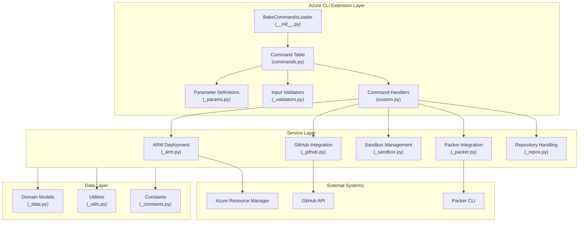
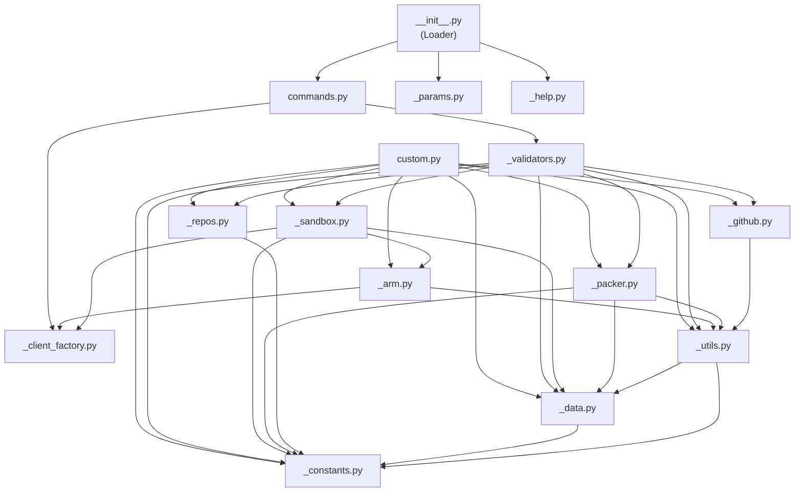
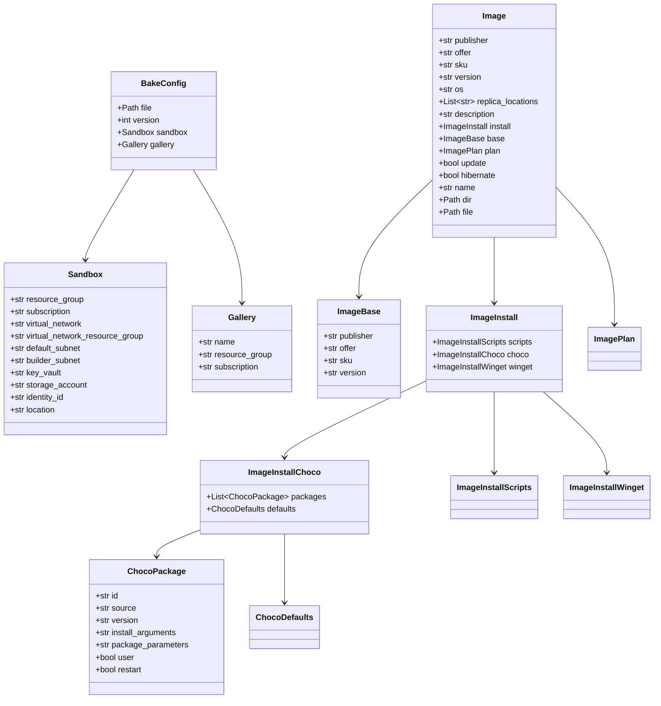
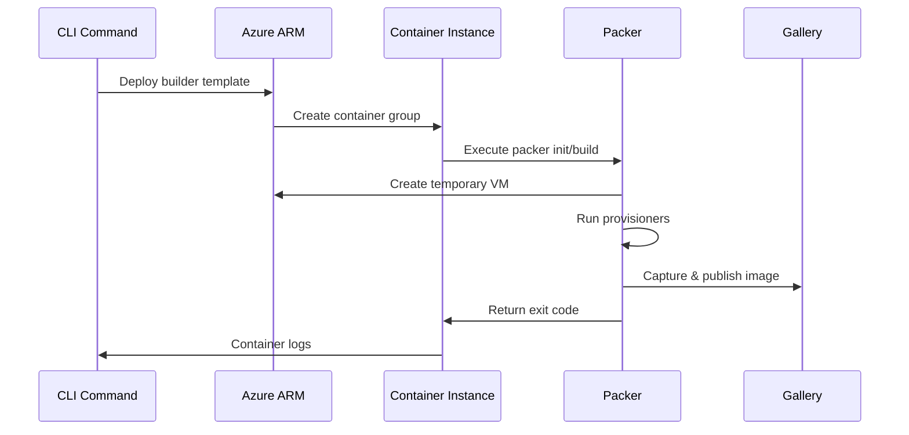
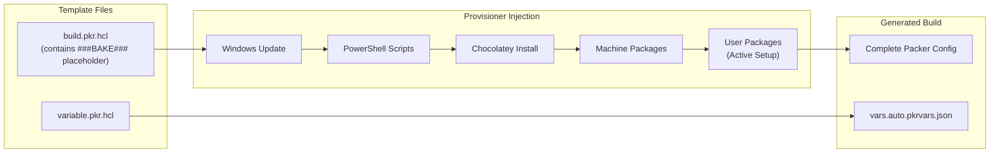
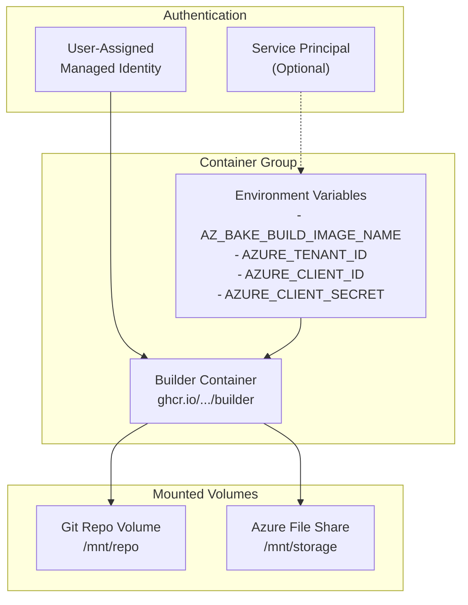
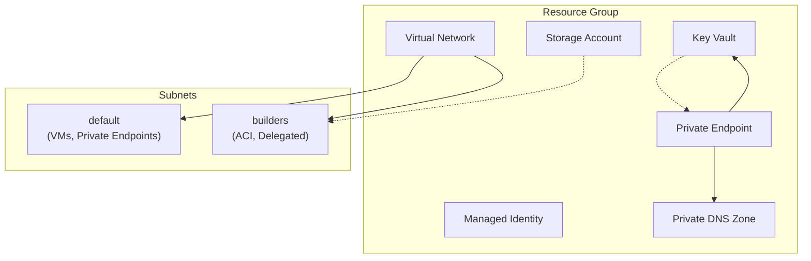

# Technical Architecture Analysis: az-bake

## Executive Summary

**az-bake** is a Python-based Azure CLI extension that automates the creation of custom virtual machine images using HashiCorp Packer within an Azure Container Instance (ACI) execution environment. The extension follows the Azure CLI extension architecture pattern, implementing a modular command structure with clear separation between command definitions, business logic, data models, and Azure resource management.

**Key Technologies:**
- Python 3.7+ with Azure CLI SDK
- HashiCorp Packer for VM image building
- Azure Resource Manager (ARM) for infrastructure deployment
- Bicep for Infrastructure as Code
- Docker for the builder container image

**Architectural Pattern:** Command-based modular architecture following Azure CLI extension conventions, with domain-driven data models and a layered service structure.

## Technology Stack

### Core Technologies
| Technology | Version | Purpose |
|------------|---------|---------|
| Python | 3.7 - 3.10 | Primary language |
| Azure CLI Core | Latest | CLI framework and Azure authentication |
| HashiCorp Packer | Latest | VM image building automation |
| Bicep | Latest | Infrastructure as Code templates |
| YAML | 1.1 | Configuration file format |
| Docker | Latest | Builder container packaging |

### External Dependencies
| Package | Purpose |
|---------|---------|
| `azure-cli-core` | Azure CLI framework integration |
| `azure-mgmt-containerinstance` | Container instance management |
| `azure-mgmt-compute` | Gallery and image operations |
| `azure-mgmt-network` | Virtual network operations |
| `azure-mgmt-keyvault` | Key vault operations |
| `azure-mgmt-storage` | Storage account operations |
| `azure-mgmt-msi` | Managed identity operations |
| `azure-mgmt-authorization` | RBAC role assignments |
| `requests` | HTTP client for GitHub API |
| `pyyaml` | YAML parsing |
| `packaging` | Semantic versioning |
| `knack` | CLI logging utilities |

## Architecture Overview

### High-Level Architecture Diagram



### Architecture Pattern

The extension follows the **Azure CLI Extension Pattern** with these layers:

1. **Command Layer** - Entry point, command registration, parameter binding
2. **Validation Layer** - Input validation and namespace processing
3. **Service Layer** - Business logic implementation
4. **Data Layer** - Domain models and data transformation
5. **Infrastructure Layer** - Azure SDK clients and external tool integration

## Project Structure

### Solution Organization

```
bake/
├── __init__.py           # Package marker
├── setup.py              # Package configuration and dependencies
├── setup.cfg             # Package metadata
├── azext_bake/
│   ├── __init__.py       # Command loader (entry point)
│   ├── commands.py       # Command table registration
│   ├── custom.py         # Command implementation handlers
│   ├── _params.py        # Parameter definitions
│   ├── _validators.py    # Input validation logic
│   ├── _help.py          # CLI help text
│   ├── _data.py          # Domain data models (dataclasses)
│   ├── _arm.py           # Azure ARM deployment operations
│   ├── _packer.py        # Packer CLI integration
│   ├── _sandbox.py       # Sandbox resource management
│   ├── _github.py        # GitHub API integration
│   ├── _repos.py         # Repository provider abstraction
│   ├── _client_factory.py # Azure SDK client factories
│   ├── _constants.py     # Application constants
│   ├── _utils.py         # Utility functions
│   ├── _completers.py    # Tab completion helpers
│   ├── _transformers.py  # Output transformers
│   └── templates/        # Embedded templates
│       ├── builder/      # ARM templates for builder
│       ├── install/      # Package installation configs
│       ├── packer/       # Packer HCL templates
│       └── sandbox/      # Sandbox Bicep templates
```

### Dependency Graph



## Data Architecture

### Domain Models

The application uses Python dataclasses for domain modeling with custom validation:



### Data Validation Pattern

Domain objects implement validation in their constructors using a centralized `_validate_data_object` function:

```python
def _validate_data_object(data_type: type, obj: dict, path: Path = None, parent_key: str = None):
    """Validates required fields exist and no invalid fields are present"""
    flds = fields(data_type)
    all_fields = [_snake_to_camel(f.name) for f in flds]
    req_fields = [_snake_to_camel(f.name) for f in flds if f.default is MISSING]
    
    for k in req_fields:
        if k not in obj or not obj[k]:
            raise ValidationError(f'{name} is missing required property: {key_prefix}{k}')
    for k in obj:
        if k not in all_fields:
            raise ValidationError(f'{name} contains invalid property: {key_prefix}{k}')
```

### Configuration Files

| File | Schema | Purpose |
|------|--------|---------|
| `bake.yml` | `bake.schema.json` | Repository-level configuration |
| `image.yml` | `image.schema.json` | Individual image definitions |

### Schema Validation

JSON Schema files in `schema/` provide IDE validation support:

**bake.schema.json** - Repository configuration schema:
```json
{
  "required": ["version", "sandbox", "gallery"],
  "properties": {
    "version": { "const": 1.0 },
    "sandbox": { /* 9 required properties */ },
    "gallery": { /* name, resourceGroup required */ }
  }
}
```

**image.schema.json** - Image definition schema:
```json
{
  "required": ["publisher", "offer", "sku", "version", "os", "replicaLocations"],
  "properties": {
    "base": { /* publisher, offer, sku required */ },
    "install": {
      "choco": { /* packages array */ },
      "winget": { /* packages array */ },
      "scripts": { /* powershell array */ }
    }
  }
}
```

### Example Configuration

**bake.yml**:
```yaml
version: 1.0
sandbox:
  resourceGroup: my-sandbox-rg
  subscription: 00000000-0000-0000-0000-000000000000
  virtualNetwork: my-sandbox-vnet
  virtualNetworkResourceGroup: my-sandbox-rg
  defaultSubnet: default
  builderSubnet: builders
  keyVault: my-sandbox-kv
  storageAccount: mysandboxstorage
  identityId: /subscriptions/.../userAssignedIdentities/my-id
gallery:
  name: my_gallery
  resourceGroup: gallery-rg
```

**image.yml**:
```yaml
name: VSCodeBox
publisher: Contoso
offer: DevBox
sku: win11-vscode
version: 1.0.0
os: Windows
replicaLocations: [eastus, westeurope]
update: true
base:
  publisher: microsoftwindowsdesktop
  offer: windows-ent-cpc
  sku: win11-22h2-ent-cpc-m365
install:
  choco:
    packages: [git, vscode]
  scripts:
    powershell:
      - scripts/Install-Tools.ps1
```

## Service Architecture

### Command Handler Organization

Commands are organized by domain in `commands.py`:

| Command Group | Description | Handler Module |
|---------------|-------------|----------------|
| `bake` | Root group, version, upgrade | `custom.py` |
| `bake sandbox` | Sandbox lifecycle | `custom.py` → `_arm.py`, `_sandbox.py` |
| `bake repo` | Repository operations | `custom.py` → `_repos.py` |
| `bake image` | Image management | `custom.py` → `_packer.py` |
| `bake yaml` | Configuration export | `custom.py` |
| `bake validate` | Validation aliases | `custom.py` |
| `bake _builder` | Internal builder commands | `custom.py` → `_packer.py` |

### Service Layer Responsibilities

| Module | Responsibilities |
|--------|-----------------|
| `_arm.py` | ARM/Bicep template deployments, resource group management, gallery operations, RBAC assignments |
| `_packer.py` | Packer file generation, provisioner injection, Packer CLI execution, variable file management |
| `_sandbox.py` | Sandbox resource discovery, resource naming conventions, network configuration |
| `_github.py` | GitHub release API, template downloads, version checking |
| `_repos.py` | Repository URL parsing, CI environment detection, provider abstraction |

### Client Factory Pattern

Azure SDK clients are created through factory functions in `_client_factory.py`:

```python
def cf_compute(cli_ctx, **kwargs):
    return get_mgmt_service_client(cli_ctx, ResourceType.MGMT_COMPUTE,
                                   subscription_id=kwargs.get('subscription_id'),
                                   aux_subscriptions=kwargs.get('aux_subscriptions'))
```

**Available Factories:**
- `cf_resources` - Resource management
- `cf_compute` - Compute gallery operations
- `cf_network` - Virtual network operations  
- `cf_storage` - Storage account operations
- `cf_keyvault` - Key vault operations
- `cf_msi` - Managed identity operations
- `cf_auth` - Authorization/RBAC operations
- `cf_container` / `cf_container_groups` - Container instance operations

### CLI Tab Completion

The `_completers.py` module provides dynamic tab completion:

```python
@Completer
def get_version_completion_list(cmd, prefix, ns, **kwargs):
    return [r['tag_name'] for r in get_github_releases()]
```

**Available Completers:**
| Completer | Purpose |
|-----------|--------|
| `get_version_completion_list` | GitHub release versions |
| `get_resource_name_completion_list` | Azure resources by type |

## Cross-Cutting Concerns

### Logging and Monitoring

The extension uses knack's logging framework with file output support when running in the builder container:

```python
def get_logger(name):
    _logger = knack_get_logger(name)
    if IN_BUILDER and STORAGE_DIR.is_dir():
        log_file = OUTPUT_DIR / 'builder.log'
        fh = logging.FileHandler(log_file)
        _logger.addHandler(fh)
    return _logger
```

**Log Destinations:**
- Console output (default)
- `builder.log` file (when running in container)
- `chocolatey.log` (downloaded from VM after build)

### Error Handling

The extension uses Azure CLI's error hierarchy:

| Error Type | Usage |
|------------|-------|
| `CLIError` | General errors |
| `ValidationError` | Input validation failures |
| `InvalidArgumentValueError` | Invalid parameter values |
| `MutuallyExclusiveArgumentError` | Conflicting arguments |
| `RequiredArgumentMissingError` | Missing required parameters |
| `ResourceNotFoundError` | Resource not found |
| `ClientRequestError` | HTTP/API errors |

### Configuration Management

**Configuration Sources:**
1. CLI arguments (highest priority)
2. Azure CLI defaults (`az configure --defaults`)
3. `bake.yml` repository configuration
4. `image.yml` image definitions
5. Hardcoded constants (lowest priority)

**Configurable Defaults:**
- `bake-sandbox` - Default sandbox resource group
- `bake-gallery` - Default Azure Compute Gallery ID

### Security Implementation

| Aspect | Implementation |
|--------|----------------|
| Authentication | Azure CLI authentication (`use_azure_cli_auth`) |
| Managed Identity | User-assigned MSI for container and VM operations |
| Secrets | Azure Key Vault integration for Packer builds |
| Network Isolation | Private VNet with delegated subnets |
| RBAC | Contributor role on sandbox and gallery resource groups |
| Image Security | Trusted Launch enabled by default (Gen 2 VMs) |

## Communication Patterns

### Internal Module Communication

Modules communicate through:
1. **Direct function calls** - Service functions called from command handlers
2. **Namespace object** - Validators populate `ns` object passed to handlers
3. **Data objects** - Domain models passed between layers

### External System Integration



### GitHub Release Integration

```python
def get_release_templates(version=None, prerelease=False, templates_url=None):
    """Downloads templates.json from GitHub releases"""
    version = version or get_github_latest_release_version()
    templates_url = f'https://github.com/.../releases/download/{version}/templates.json'
    return get_release_asset(templates_url)
```

## Packer Integration Architecture

### Template Injection Pattern

The extension dynamically injects provisioners into Packer HCL files:



### Packer Variables Structure

The `variable.pkr.hcl` template defines typed variable structures:

```hcl
variable "gallery" {
  type = object({
    name          = string
    resourceGroup = string
    subscription  = string
  })
}

variable "sandbox" {
  type = object({
    resourceGroup               = string
    subscription                = string
    virtualNetwork              = string
    virtualNetworkResourceGroup = string
    defaultSubnet               = string
    builderSubnet               = string
    keyVault                    = string
    storageAccount              = string
    identityId                  = string
  })
}

variable "image" {
  type = object({
    name             = string
    version          = string
    replicaLocations = list(string)
    os               = string
    base = object({ publisher, offer, sku, version })
  })
}
```

These variables are populated at runtime via `vars.auto.pkrvars.json`.

### Provisioner Types

| Provisioner | Purpose | Trigger |
|-------------|---------|---------|
| `windows-update` | OS updates | `image.update = true` |
| `windows-restart` | VM restart | After update, after restart-required scripts |
| `powershell` | Script execution | `image.install.scripts.powershell` |
| `file` | File transfer | Chocolatey logs, settings files |

### Active Setup Pattern

User-level Chocolatey packages are installed via Windows Active Setup registry keys:

```python
def inject_choco_user_provisioners(image_dir, choco_packages):
    """Creates Active Setup entries for first-logon installation"""
    base_reg_key = 'HKLM:\\SOFTWARE\\Microsoft\\Active Setup\\Installed Components\\'
    for package in choco_packages:
        # Register install script to run on first user logon
        stubpath_value = f'Powershell -File {LOCAL_USER_DIR}/Install-ChocoUser.ps1 -PackageId {package.id}'
```

## Infrastructure as Code

### Builder Container Deployment

The `builder.bicep` template deploys the ACI container that executes Packer:



**Key Parameters:**
| Parameter | Purpose |
|-----------|--------|
| `repository` | Git clone URL for image definitions |
| `revision` | Git commit hash to checkout |
| `image` | Name of image folder to build |
| `identityId` | Managed identity resource ID |
| `subnetId` | Network isolation subnet |
| `storageAccount` | Persistent storage for logs |
| `packerVars` | Additional Packer variables |

**Outputs:**
- `logs` - Azure CLI command to view container logs
- `bake` - az bake command to view logs
- `portal` - Azure Portal URL for container

### Sandbox Bicep Template

The sandbox infrastructure is defined in `sandbox.bicep`:



### Builder Container Architecture

```dockerfile
FROM mcr.microsoft.com/azure-cli:latest
ENV AZ_BAKE_IMAGE_BUILDER=1
RUN tdnf install -y packer
RUN az extension add --source .../bake-X.X.X-py3-none-any.whl -y
ENTRYPOINT ["az", "bake", "_builder", "build", "--verbose"]
```

**Container Execution Flow:**
1. ACI mounts repository from storage
2. Container authenticates via managed identity
3. `az bake _builder build` executes Packer
4. Logs written to mounted storage volume

## Testing Architecture

### Current State

The codebase does not include formal unit tests or integration tests. Testing is primarily manual through:
- Local development with `extensionType: dev`
- CI pipeline execution validation
- `az bake validate` commands

### Test Support Patterns

Code structure supports testing through:
- **Dependency injection** via CLI context
- **Factory pattern** for SDK clients
- **Environment detection** (`IN_BUILDER` flag)
- **Validation bypass** for dev-mode testing

## Refactoring Analysis

### Service Boundary Recommendations

#### Potential Service 1: Sandbox Infrastructure Service

**Responsibilities:**
- Sandbox provisioning and lifecycle
- Network configuration
- Identity and permission management

**Data Dependencies:**
- Azure Resource Manager APIs
- Bicep templates
- Resource group tags

**Components:**
- `_sandbox.py`
- `_arm.py` (ARM deployment functions)
- `templates/sandbox/`

#### Potential Service 2: Image Build Orchestration Service

**Responsibilities:**
- Packer template generation
- Build execution and monitoring
- Container instance management

**Data Dependencies:**
- Packer templates
- Container logs
- Gallery image metadata

**Components:**
- `_packer.py`
- `custom.py` (builder functions)
- `templates/packer/`

#### Potential Service 3: Repository Configuration Service

**Responsibilities:**
- Repository validation
- Configuration file management
- CI/CD workflow generation

**Data Dependencies:**
- `bake.yml` and `image.yml` files
- Git repository metadata
- CI environment variables

**Components:**
- `_repos.py`
- `_data.py` (BakeConfig, Image models)
- `_validators.py` (repository validators)

### Shared Components

| Component | Current Location | Sharing Strategy |
|-----------|------------------|------------------|
| Domain Models | `_data.py` | Extract to shared library |
| Constants | `_constants.py` | Configuration service |
| Azure SDK Clients | `_client_factory.py` | Shared SDK wrapper |
| Validation Utilities | `_validators.py` | Common validation library |

### Data Coupling Analysis

**Current Coupling Points:**
1. **Namespace object** - Validators mutate shared namespace
2. **Constants** - Global constants shared across modules
3. **Data models** - Domain objects passed between all layers
4. **File system** - Templates and config files

**Decoupling Recommendations:**
1. Replace namespace mutation with explicit return values
2. Move configuration to injectable settings object
3. Define clear service interfaces with DTOs
4. Abstract file system access through repository pattern

### Technical Debt and Improvements

#### Code Quality Issues

| Issue | Location | Impact |
|-------|----------|--------|
| No unit tests | All modules | Low confidence in changes |
| Namespace mutation | `_validators.py` | Hidden state changes |
| Long functions | `custom.py` | Difficult to maintain |
| Mixed responsibilities | `_arm.py` | Gallery ops mixed with ARM deployments |
| Commented code | Multiple files | Unclear intent |

#### Architecture Violations

| Violation | Description | Recommendation |
|-----------|-------------|----------------|
| Cross-layer imports | Validators import domain services | Introduce interface layer |
| Circular potential | Utils imports data, data uses constants in utils | Restructure dependencies |
| God module | `custom.py` contains all handlers | Split by domain |

### Performance Considerations

| Area | Current State | Improvement |
|------|---------------|-------------|
| ARM deployments | Sequential with retries | Add parallel deployment support |
| GitHub API calls | Synchronous with retry loop | Add caching layer |
| Packer execution | Single-threaded | Each image builds in separate container |
| File I/O | Synchronous reads | Batch YAML loading |

## Recommendations

### Immediate Improvements

1. **Add type hints** - Improve IDE support and documentation
2. **Extract service interfaces** - Define clear boundaries
3. **Add unit tests** - Focus on validators and data models
4. **Reduce namespace mutation** - Return explicit values from validators
5. **Split command handlers** - Separate `custom.py` by domain

### Long-term Refactoring Strategy

1. **Phase 1: Test Foundation**
   - Add pytest infrastructure
   - Create fixtures for Azure SDK mocks
   - Test data model validation

2. **Phase 2: Service Extraction**
   - Define service interfaces
   - Extract sandbox management
   - Extract Packer orchestration

3. **Phase 3: Configuration Service**
   - Centralize settings management
   - Add configuration validation
   - Support environment-based config

4. **Phase 4: API Layer**
   - If needed, expose REST API
   - Consider Azure Functions for background builds
   - Event-driven architecture for build notifications

### Migration Risks

| Risk | Mitigation |
|------|------------|
| Azure SDK version changes | Pin dependencies, integration tests |
| Packer plugin updates | Version lock in templates |
| CLI framework changes | Follow Azure CLI deprecation notices |
| Breaking config changes | Schema versioning, migration scripts |

## Appendix: Key File References

| File | Description |
|------|-------------|
| [__init__.py](../bake/azext_bake/__init__.py) | Command loader entry point |
| [commands.py](../bake/azext_bake/commands.py) | Command table registration |
| [custom.py](../bake/azext_bake/custom.py) | Command handler implementations |
| [_data.py](../bake/azext_bake/_data.py) | Domain data models |
| [_arm.py](../bake/azext_bake/_arm.py) | ARM deployment operations |
| [_packer.py](../bake/azext_bake/_packer.py) | Packer integration |
| [_sandbox.py](../bake/azext_bake/_sandbox.py) | Sandbox management |
| [_completers.py](../bake/azext_bake/_completers.py) | CLI tab completion |
| [_validators.py](../bake/azext_bake/_validators.py) | Input validation logic |
| [sandbox.bicep](../bake/azext_bake/templates/sandbox/sandbox.bicep) | Sandbox infrastructure template |
| [builder.bicep](../bake/azext_bake/templates/builder/builder.bicep) | ACI container deployment template |
| [build.pkr.hcl](../bake/azext_bake/templates/packer/build.pkr.hcl) | Packer build template |
| [variable.pkr.hcl](../bake/azext_bake/templates/packer/variable.pkr.hcl) | Packer variable definitions |
| [Dockerfile](../builder/Dockerfile) | Builder container definition |
| [bake.schema.json](../schema/bake.schema.json) | bake.yml JSON schema |
| [image.schema.json](../schema/image.schema.json) | image.yml JSON schema |

## Appendix: Technology Note

This application is a **Python-based Azure CLI extension**, not a .NET application. The architecture analysis template may reference .NET patterns, but all implementations use:
- **Python 3.7+** with dataclasses for domain models
- **Azure SDK for Python** (`azure-mgmt-*` packages)
- **Azure CLI SDK** (`azure-cli-core`) for CLI framework
- **HashiCorp Packer** (external CLI tool) for image building
- **Bicep/ARM** for Azure infrastructure deployment
